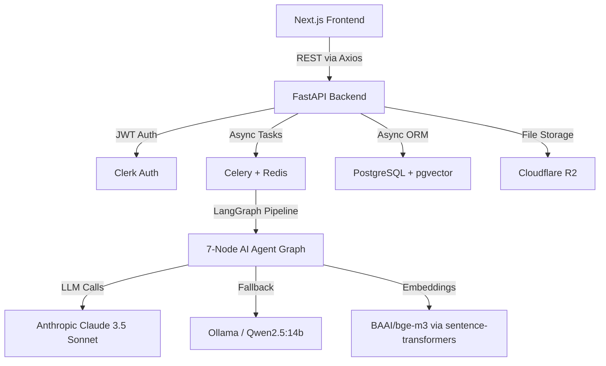
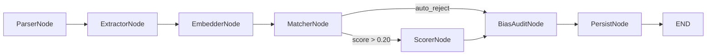

# TalentFlowAI — Complete Project Analysis Report

**Date:** 2026-05-17  
**Project:** TalentFlow AI — AI-Assisted Hiring Platform  
**Type:** Final Year Project (FYP) / Startup Prototype

---

## 1. Project Overview

TalentFlowAI is a full-stack AI-powered recruitment intelligence platform that automates CV screening, semantic matching, explainable scoring, and bias auditing. Recruiters upload CVs (PDF/DOCX) against a job description; the system parses, extracts structured profiles via LLM, generates vector embeddings, computes semantic similarity, produces explainable scores, runs a bias audit, and presents a ranked shortlist.

### Architecture Summary

---

## 2. Complete Technology Stack

### 2.1 Backend

| Category | Technology | Version | Purpose |
|---|---|---|---|
| **Runtime** | Python | ≥3.12 | Core language |
| **Web Framework** | FastAPI | 0.115.6 | Async REST API |
| **ASGI Server** | Uvicorn | ≥0.30.0 | HTTP server |
| **AI Orchestration** | LangGraph | 0.3.21 | 7-node agent pipeline |
| **Primary LLM** | Anthropic Claude 3.5 Sonnet | via langchain-anthropic 0.3.10 | CV extraction & scoring |
| **Fallback LLM** | Ollama (Qwen2.5:14b) | local | Circuit-breaker fallback |
| **Embeddings** | BAAI/bge-m3 | via sentence-transformers 3.3.1 | 1024-dim semantic vectors |
| **Task Queue** | Celery | 5.4.0 | Async CV processing |
| **Message Broker** | Redis | 5.2.1 | Broker + result backend |
| **ORM** | SQLAlchemy | 2.0.36 | Async DB access |
| **DB Driver** | asyncpg | 0.30.0 | PostgreSQL async driver |
| **Vector DB** | pgvector | 0.3.6 | Vector similarity search |
| **Migrations** | Alembic | 1.14.0 | Schema migrations |
| **Validation** | Pydantic | 2.10.4 | Request/response schemas |
| **Settings** | pydantic-settings | ≥2.0.0 | .env configuration |
| **PDF Parsing** | pdfplumber | 0.11.4 | Primary PDF parser |
| **PDF Fallback** | PyMuPDF | 1.25.1 | Fallback PDF parser |
| **DOCX Parsing** | python-docx | 1.1.2 | Word document parser |
| **Auth** | Clerk Backend API | 1.7.0 | JWT verification |
| **Resilience** | circuitbreaker | 2.0.0 | LLM circuit breaker |
| **File Validation** | python-magic | 0.4.27 | MIME type checking |
| **Observability** | Logfire | 2.7.0 | Structured logging |
| **Error Tracking** | Sentry SDK | 2.19.2 | Error monitoring |
| **Pkg Manager** | uv + hatchling | latest | Dependency management |
| **Testing** | pytest + pytest-asyncio | ≥8.0 / ≥0.23 | Test framework |

### 2.2 Frontend

| Category | Technology | Version | Purpose |
|---|---|---|---|
| **Framework** | Next.js | 15.5.18 | React SSR framework |
| **React** | React | 19.1.0 | UI library |
| **Bundler** | Turbopack | built-in | Dev/build bundler |
| **Styling** | Tailwind CSS | v4 | Utility CSS |
| **Auth** | @clerk/nextjs | ^7.3.5 | Auth provider |
| **Data Fetching** | @tanstack/react-query | ^5.100.10 | Server state management |
| **HTTP Client** | Axios | ^1.16.1 | API communication |
| **State Mgmt** | Zustand | ^5.0.13 | Client state (pipeline) |
| **Icons** | lucide-react | ^1.16.0 | Icon library |
| **Utilities** | clsx + tailwind-merge | latest | Class merging |
| **Language** | TypeScript | ^5 | Type safety |

### 2.3 Infrastructure

| Category | Technology | Version | Purpose |
|---|---|---|---|
| **Database** | PostgreSQL | 16 (pgvector image) | Primary data store |
| **Cache/Broker** | Redis | 7 (Alpine) | Celery broker + JWT cache |
| **Containerization** | Docker Compose | v3.8/3.9 | Local dev orchestration |
| **File Storage** | Cloudflare R2 | — | CV file storage (S3-compatible) |
| **Auth Provider** | Clerk | — | User auth + org management |

---

## 3. What Has Been Built

### 3.1 Backend — Implemented Modules

#### ✅ FastAPI Application Core ([main.py](file:///c:/Users/Tony_Stark/Professional/Startup/FYP/TalentFlowAI/talentflow-backend/app/main.py))
- FastAPI app with lifespan context manager
- CORS middleware (open for dev)
- Custom `RequestContextMiddleware` — injects `X-Request-ID` per request, logs method/path/status/duration
- Global exception handlers: `TalentFlowException` (structured) + catch-all 500
- API router mounted at `/api/v1`
- Health check at `/health`

#### ✅ Configuration ([config.py](file:///c:/Users/Tony_Stark/Professional/Startup/FYP/TalentFlowAI/talentflow-backend/app/config.py))
- 27 environment variables via `pydantic-settings`
- Loads from `.env.local`; supports DATABASE_URL, REDIS_URL, ANTHROPIC_API_KEY, Clerk keys, R2 credentials, embedding model config, thresholds

#### ✅ Database Models (9 SQLAlchemy ORM models)

| Model | Table | Key Columns |
|---|---|---|
| `Organization` | `organizations` | name, slug, clerk_org_id, plan, settings |
| `User` | `users` | org_id (FK), clerk_user_id, email, role |
| `Job` | `jobs` | org_id, created_by, title, description, requirements, scoring_rubric, embedding (Vector), status |
| `Batch` | `batches` | org_id, job_id, submitted_by, idempotency_key, status, total/processed/failed CVs, celery_task_id |
| `Candidate` | `candidates` | org_id, job_id, batch_id, r2_key, profile (JSON), embedding (Vector), scores, processing_status, recruiter_status |
| `Shortlist` | `shortlists` | batch_id, candidate_id, job_id, org_id, rank |
| `BiasAuditLog` | `bias_audit_log` | candidate_id, org_id, detected_signals (JSON), raw_text_excerpt |
| `Interview` | `interviews` | candidate_id, job_id, scheduled_by, scheduled_at, format, meeting_link, status |
| `Base/BaseModel` | abstract | UUID PK, created_at, updated_at |

#### ✅ Alembic Migrations
- Configured for async PostgreSQL
- 1 migration generated: `e66abba25771_initial_schema_with_flexible_vectors.py`
- All 8 tables with pgvector extension enabled

#### ✅ LangGraph AI Pipeline (7 Nodes)

| Node | File | Status | Description |
|---|---|---|---|
| **ParserNode** | `nodes/parser.py` | ✅ Complete | Downloads from R2 → pdfplumber → PyMuPDF → OCR fallback chain. Returns raw_text + confidence + strategy |
| **ExtractorNode** | `nodes/extractor.py` | ✅ Complete | Truncates text (6k tokens via tiktoken), calls Claude 3.5 Sonnet with structured extraction prompt, validates via `CandidateProfile` Pydantic model, normalizes skills via taxonomy, calculates experience years, assigns seniority level |
| **EmbedderNode** | `nodes/embedder.py` | ✅ Complete | Constructs embedding text from skills/experience/seniority, generates 1024-dim bge-m3 vector via singleton EmbeddingService |
| **MatcherNode** | `nodes/matcher.py` | ✅ Complete | Computes cosine similarity between candidate and JD embeddings, applies AUTO_REJECT_THRESHOLD (0.20) |
| **ScorerNode** | `nodes/scorer.py` | ✅ Complete | Strips PII from profile, calls Claude with scoring rubric (4 dimensions: skills/experience/education/growth), calculates weighted LLM score, hybrid score (60% LLM + 40% semantic), outlier detection |
| **BiasAuditNode** | `nodes/bias_audit.py` | ✅ Complete | Detects name, location, graduation year (age proxy), and gender pronouns via regex. Logs to separate table; never modifies scores |
| **PersistNode** | `nodes/persist.py` | ✅ Complete | Single DB transaction: UPDATE candidate + INSERT bias_audit_log + UPDATE batch counter. Auto-detects batch completion |

#### ✅ Pipeline State ([state.py](file:///c:/Users/Tony_Stark/Professional/Startup/FYP/TalentFlowAI/talentflow-backend/app/agents/state.py))
- Full `TypedDict` with 23 typed fields covering all 7 node inputs/outputs
- Conditional routing: auto-reject skips scoring → goes directly to bias audit

#### ✅ LLM Prompts ([prompts.py](file:///c:/Users/Tony_Stark/Professional/Startup/FYP/TalentFlowAI/talentflow-backend/app/agents/prompts.py))
- `EXTRACTION_SYSTEM_PROMPT` — verbatim-only extraction, ISO 8601 dates, JSON schema output
- `SCORING_SYSTEM_PROMPT` — 4-dimension rubric scoring (0-10), with justifications, no bias signals

#### ✅ API Endpoints (5 route groups)

| Group | Endpoint | Method | Auth | Description |
|---|---|---|---|---|
| **Health** | `/api/v1/health` | GET | — | Health check |
| **Jobs** | `/api/v1/jobs` | POST | Recruiter | Create job with requirements + rubric |
| | `/api/v1/jobs` | GET | Any | List org jobs |
| | `/api/v1/jobs/{id}/candidates` | GET | Any | List candidates for job (sorted by score) |
| **Pipeline** | `/api/v1/pipeline/upload-urls` | POST | Recruiter | Get R2 presigned upload URLs |
| | `/api/v1/pipeline/submit` | POST | Recruiter | Submit batch → triggers Celery task |
| | `/api/v1/pipeline/{batch_id}` | GET | Any | Poll batch status |
| **Candidates** | `/api/v1/candidates/{id}` | GET | Any | Get single candidate detail |
| | `/api/v1/candidates/{id}/status` | PATCH | Any | Update recruiter status + note |
| **Shortlists** | `/api/v1/shortlists/batch/{id}` | GET | Any | Get shortlist for batch |

#### ✅ Service Layer (6 services)
- **PipelineService** — batch submission with idempotency, Celery dispatch
- **JobService** — CRUD for jobs
- **CandidateService** — get candidate, update recruiter status
- **ShortlistService** — returns candidates sorted by score, excluding auto-rejected
- **AnalyticsService** — stub (returns zeros)
- **ReportService** — stub (empty)

#### ✅ Repository Layer (Generic + 4 specific)
- Generic `BaseRepository[T]` with get/get_multi/create/update/delete
- `BatchRepository` — get_by_idempotency_key
- `CandidateRepository` — get_by_batch
- `JobRepository` — get_by_org
- `ShortlistRepository` — base only

#### ✅ Utilities
- **file_parser.py** — 3-strategy PDF chain (pdfplumber → PyMuPDF → OCR) + DOCX parser
- **embeddings.py** — Singleton EmbeddingService with bge-m3, fallback to all-MiniLM-L6-v2
- **storage.py** — R2 download/upload/verify stubs (local file fallback for testing)
- **skills_taxonomy.py** — 50+ canonical skills with 100+ aliases (JSON-backed normalization)
- **experience_calculator.py** — Overlapping date range deduplication algorithm

#### ✅ Core Infrastructure
- **auth.py** — Clerk JWT verification with Redis caching, dev-mode bypass
- **rbac.py** — Role-based access: admin/recruiter/hiring_manager/viewer
- **circuit_breaker.py** — Anthropic circuit breaker (5 failures → 60s open → Ollama fallback)
- **middleware.py** — Request ID injection + structured logging
- **exceptions.py** — Structured error envelope with TalentFlowException

#### ✅ Celery Workers
- **celery_app.py** — 3 priority queues (cv_processing/reporting/notifications), acks_late, prefetch=1, 5min soft/6min hard limits, max 3 retries
- **cv_tasks.py** — `process_cv_batch` (fan-out) + `process_single_cv` (runs LangGraph graph)
- **notification_tasks.py** — stub for batch completion email
- **report_tasks.py** — stub for report generation

#### ✅ Docker Compose
- Root: PostgreSQL 16 (pgvector) + Redis 7
- Backend: adds API container + Celery worker container

---

### 3.2 Frontend — Implemented Modules

#### ✅ Pages (3 pages)

| Page | Route | Description |
|---|---|---|
| **Dashboard** | `/` | Dark theme landing with analytics cards, active job listings, "Create Job" form with sample pre-fill. Uses React Query for live data |
| **Pipeline** | `/jobs/[jobId]/pipeline` | CV drag-and-drop upload zone, batch processing trigger, progress bar with polling (3s interval), 5-step agent status timeline |
| **Shortlist** | `/jobs/[jobId]/shortlist` | Ranked candidate table with score badges (color-coded), search filter, candidate detail drawer with scores/justifications/raw JSON, shortlist/reject actions |

#### ✅ Components (5 components)

| Component | Description |
|---|---|
| `CVDropzone` | Drag-and-drop file upload with staged file list, progress bars, status indicators |
| `AgentStatusTimeline` | 5-step vertical timeline (upload → extract → embed → score → bias) with animated status |
| `CandidateTable` | Sortable table with avatar, score, skills bar, experience, status badges |
| `CandidateDrawer` | Slide-over panel with 3-metric header (total/semantic/LLM), score breakdown bars, AI justifications, raw JSON viewer |
| `ScoreBreakdown` | 4-dimension gradient progress bars (skills/experience/education/growth) |

#### ✅ API Layer (6 modules)
- `client.ts` — Axios instance with Clerk token interceptor + response envelope unwrapping
- `jobs.ts` — getJobs, getJob, createJob, getCandidatesForJob
- `pipeline.ts` — getUploadUrls, submitBatch, getBatchStatus, uploadFileDirectly
- `candidates.ts` — getCandidate, updateCandidateStatus
- `shortlists.ts` — getShortlistForBatch
- `query-keys.ts` — Structured React Query key factory

#### ✅ State Management
- `pipeline-store.ts` — Zustand store for staged files, upload progress, batch tracking
- `query-provider.tsx` — React Query provider with 1min stale time

#### ✅ Infrastructure
- Next.js API proxy (`/api/*` → `localhost:8001/api/*`)
- Google Fonts: Inter + JetBrains Mono
- Dark glassmorphism theme with indigo/purple gradients
- Clerk env vars configured

---

## 4. Testing Status

### 4.1 What Has Been Tested

| Test | Type | Status | Details |
|---|---|---|---|
| **E2E Pipeline Test** | `e2e_test.py` (479 lines) | ✅ Written & Runnable | Full pipeline for 2 candidates (DOCX high-quality + PDF mid-level) against a real JD. Tests parser → heuristic extraction → embedding → cosine matching → heuristic scoring → bias audit → DB persistence. Includes ranking verification (high > mid) |
| **Test Fixtures** | `conftest.py` | ✅ Written | DB session factory, mock LLM factory, sample candidate profile fixture. Auto-creates/drops all tables per session |
| **Sample Data** | 3 test files | ✅ Present | `Senior_Backend_Engineer_Job_Description.txt`, `Highly_Qualified_Senior_Backend_Engineer_Resume.docx`, `Mid_Level_Backend_Engineer_Resume.pdf` |

### 4.2 What Has NOT Been Tested

| Area | Details |
|---|---|
| **Unit tests** | No `test_*.py` files exist in `/tests/`. No unit tests for any node, service, repository, or utility |
| **API integration tests** | No tests for FastAPI endpoints (no TestClient usage) |
| **Frontend tests** | No Jest/Vitest/Playwright tests exist |
| **Celery worker tests** | No mock-broker tests for task routing or retries |
| **Auth/RBAC tests** | Clerk JWT verification untested; RBAC role checks untested |
| **Circuit breaker tests** | No tests for Anthropic failure → Ollama fallback path |
| **Edge cases** | Corrupted files, oversized uploads, concurrent batch processing, duplicate submissions |

---

## 5. Known Issues & Technical Debt

> [!WARNING]
> ### Critical Issues

1. **`get_db` imports from `tests/conftest.py`** — The API route files (`jobs.py`, `candidates.py`, `shortlists.py`) import `async_session` from `tests/conftest.py` for the database dependency. This means the production API depends on test infrastructure. A proper `app/core/database.py` module is needed.

2. **No production database session management** — There is no `app/core/database.py` with a proper `get_db` dependency. The `lifespan` function in `main.py` has placeholder comments but no actual DB pool initialization.

3. **R2 storage is fully stubbed** — `storage.py` returns dummy data. No actual S3/R2 client integration exists. Presigned URL generation returns fake URLs.

4. **Clerk auth is bypassed** — In `development` mode, all auth returns a hardcoded mock user. Real JWT verification is commented out.

5. **MatcherNode uses dummy job embeddings** — `_get_job_embedding()` returns `[0.1] * 1024` instead of fetching real cached embeddings.

6. **ScorerNode uses hardcoded job requirements** — `_get_job_context()` returns static requirements instead of fetching from DB.

7. **OCR fallback is not implemented** — `parse_pdf_ocr()` returns `None, 0.0`.

> [!NOTE]
> ### Non-Critical Debt

8. **No Dockerfile** — Docker Compose references a build context but no `Dockerfile` exists in the backend
9. **Two conflicting docker-compose files** — Root and backend have different postgres credentials (postgres/postgres vs user/pass)
10. **LangGraph checkpointing disabled** — `AsyncPostgresSaver` is commented out; pipeline has no crash recovery
11. **Embedding model loaded at import time** — Can cause slow startup and failures if model download is needed
12. **`tiktoken` imported but not in dependencies** — Used in ExtractorNode but missing from `pyproject.toml`
13. **Frontend Clerk middleware is a no-op** — `middleware.ts` passes all requests through without auth checks
14. **No error boundaries in frontend** — No React error boundaries for graceful failure handling

---

## 6. Remaining Work to Full-Working Prototype

### Phase 1: Fix Critical Backend Foundations (Priority: 🔴 CRITICAL)

| # | Task | Effort | Details |
|---|---|---|---|
| 1.1 | **Create `app/core/database.py`** | 1 hr | Proper async engine + session factory + `get_db` dependency. Remove imports from `tests/conftest.py` in all route files |
| 1.2 | **Wire lifespan startup/shutdown** | 1 hr | Initialize DB pool, Redis connection, and embedding model in `main.py` lifespan |
| 1.3 | **Run Alembic migration successfully** | 30 min | Ensure `alembic upgrade head` runs against the Docker PostgreSQL with pgvector extension |
| 1.4 | **Add `tiktoken` to dependencies** | 5 min | Add to `pyproject.toml` |
| 1.5 | **Fix Docker Compose credential mismatch** | 15 min | Unify postgres user/pass across root and backend compose files |

### Phase 2: Complete Core Integrations (Priority: 🟠 HIGH)

| # | Task | Effort | Details |
|---|---|---|---|
| 2.1 | **Implement real R2 storage** | 3 hrs | Use `aiobotocore` for S3-compatible R2 uploads/downloads. Implement presigned URL generation with proper bucket config |
| 2.2 | **Wire real Clerk JWT verification** | 2 hrs | Replace mock claims with actual Clerk SDK `verify_token()`. Test with real Clerk project |
| 2.3 | **Implement real job embedding cache** | 2 hrs | On job creation, generate JD embedding via bge-m3, store in `jobs.embedding` column. Cache in Redis. MatcherNode fetches from cache/DB |
| 2.4 | **Wire ScorerNode to real job requirements** | 1 hr | Fetch `requirements` and `scoring_rubric` from `jobs` table instead of hardcoded values |
| 2.5 | **Create Candidate records on batch submit** | 2 hrs | In `PipelineService.submit_batch()`, insert a `Candidate` row per r2_key before dispatching Celery tasks |
| 2.6 | **Frontend Clerk auth integration** | 2 hrs | Wrap app in `<ClerkProvider>`, protect routes via middleware matcher, attach Bearer token to API requests |

### Phase 3: End-to-End Flow Validation (Priority: 🟡 MEDIUM)

| # | Task | Effort | Details |
|---|---|---|---|
| 3.1 | **Test full upload → process → view flow** | 3 hrs | Upload real CVs via frontend dropzone → R2 → Celery → LangGraph → DB → shortlist page |
| 3.2 | **Add `Dockerfile` for backend** | 1 hr | Multi-stage Dockerfile (build + production) with uv for dependency install |
| 3.3 | **Wire batch progress polling** | 1 hr | Verify frontend 3s polling correctly reflects batch status from backend |
| 3.4 | **Fix shortlist page data mapping** | 2 hrs | Ensure `rawCandidates` response shape matches frontend expectations (name, profile, score_breakdown fields) |
| 3.5 | **Implement analytics service** | 3 hrs | Real queries: total candidates, avg score, pass rate, score distribution |

### Phase 4: Testing & Polish (Priority: 🟢 NICE-TO-HAVE for prototype)

| # | Task | Effort | Details |
|---|---|---|---|
| 4.1 | **Write unit tests for agent nodes** | 4 hrs | Test each node independently with mocked dependencies |
| 4.2 | **Write API integration tests** | 3 hrs | FastAPI TestClient tests for all endpoints |
| 4.3 | **Add error boundaries to frontend** | 1 hr | React error boundaries + toast notifications |
| 4.4 | **Implement notification tasks** | 2 hrs | Send email on batch completion (via SMTP or SendGrid) |
| 4.5 | **Enable LangGraph checkpointing** | 2 hrs | Wire `AsyncPostgresSaver` for crash recovery |
| 4.6 | **Add OCR fallback** | 2 hrs | Integrate `pytesseract` + `pdf2image` for scanned PDFs |
| 4.7 | **Implement report generation** | 3 hrs | PDF/CSV export of batch results |

### Estimated Timeline to Working Prototype

| Phase | Total Effort | Calendar Time (solo dev) |
|---|---|---|
| Phase 1 — Fix Foundations | ~3 hours | Day 1 |
| Phase 2 — Core Integrations | ~12 hours | Days 2-3 |
| Phase 3 — E2E Validation | ~10 hours | Days 4-5 |
| Phase 4 — Testing & Polish | ~17 hours | Days 6-8 |
| **Total** | **~42 hours** | **~8 working days** |

---

## 7. Summary

### What's Strong
- **Well-designed LangGraph pipeline** — Clean 7-node DAG with proper state management, conditional routing, and error handling
- **Comprehensive data model** — 9 tables covering multi-tenant orgs, jobs, batches, candidates, shortlists, bias audit, and interviews
- **Production-grade patterns** — Circuit breaker, RBAC, idempotency keys, request tracing, structured error responses
- **Good frontend architecture** — React Query + Zustand + proper API layer separation
- **Polished UI** — Dark glassmorphism theme with gradient accents, premium feel

### What Needs Attention
- **Database dependency wiring** is broken (imports from test config)
- **Storage and auth are fully stubbed** — no real R2 or Clerk integration
- **Zero test coverage** beyond the E2E script
- **Several hardcoded values** in MatcherNode and ScorerNode need DB wiring

> [!IMPORTANT]
> The highest-impact next step is **Phase 1** (fix `get_db`, wire lifespan, run migrations). This unblocks everything else and takes ~3 hours. After that, Phase 2 items (R2, Clerk, job embeddings) are what separate the current codebase from a demonstrable end-to-end prototype.
